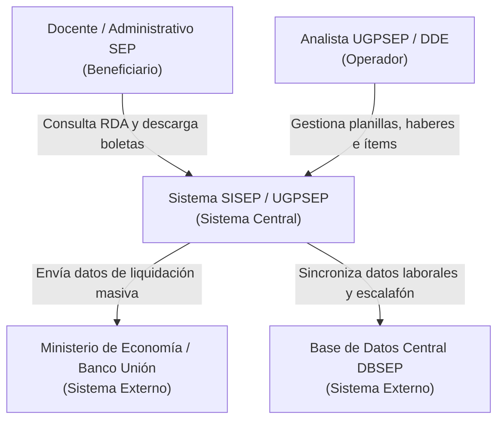

```mermaid

graph TD
    Docente["Docente / Administrativo SEP<br/>(Beneficiario)"] -->|Consulta RDA y descarga boletas| SISEP["Sistema SISEP / UGPSEP<br/>(Sistema Central)"]
    Analista["Analista UGPSEP / DDE<br/>(Operador)"] -->|Gestiona planillas, haberes e ítems| SISEP
    
    SISEP -->|Envía datos de liquidación masiva| MinEconomia["Ministerio de Economía / Banco Unión<br/>(Sistema Externo)"]
    SISEP -->|Sincroniza datos laborales y escalafón| DBSEP["Base de Datos Central DBSEP<br/>(Sistema Externo)"]

```