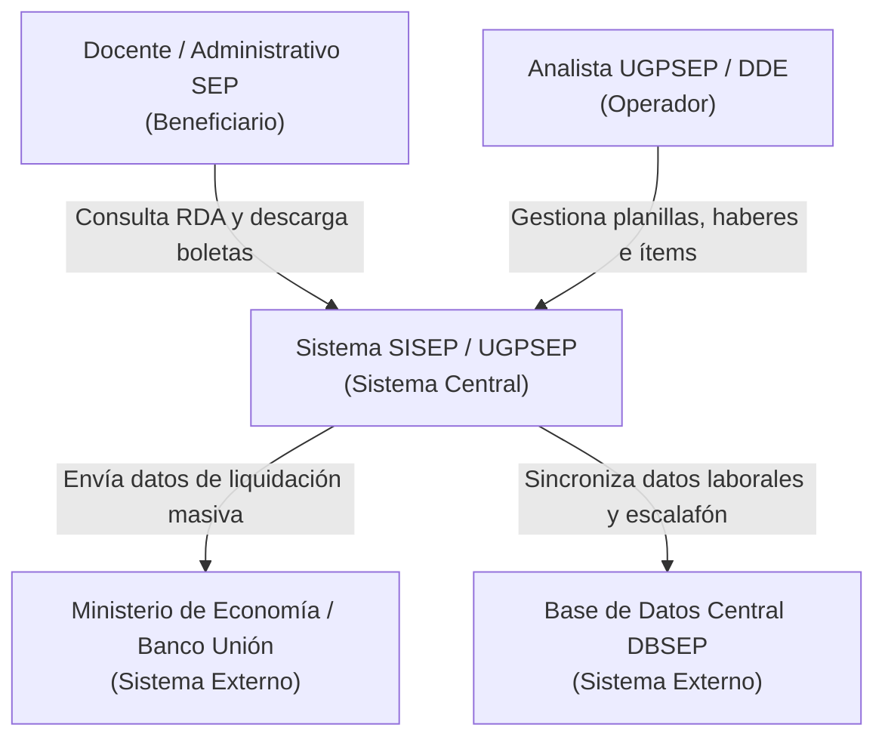

## Diagrama 1


---

## Diagrama 2
```mermaid

graph TD
    
    Docente --> FE[" Pantalla Web SISEP"]
    Analista --> FE

    
    FE -->|Usa| SO[" Sistema Principal (Backend)"]
    SO -->|Guarda datos| DB[(" Base de Datos de SISEP")]

    
    SO --- Nota[" Fusion de Patrones:<br/>1. Strategy (Cálculos)<br/>2. Observer (Notificaciones)"]

    
    SO -->|Pagos masivos| MinEco[" Ministerio de Economía"]
    SO -->|Consulta RDA| DBSEP[" Base de Datos DBSEP"]

    ```