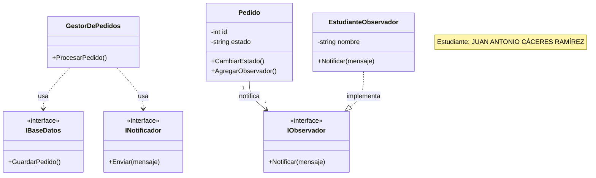

```mermaid


classDiagram
    note "Estudiante: JUAN ANTONIO CÁCERES RAMÍREZ"

    class GestorDePedidos {
        +ProcesarPedido()
    }

    class IBaseDatos {
        <<interface>>
        +GuardarPedido()
    }

    class INotificador {
        <<interface>>
        +Enviar(mensaje)
    }

    class Pedido {
        -int id
        -string estado
        +CambiarEstado()
        +AgregarObservador()
    }

    class IObservador {
        <<interface>>
        +Notificar(mensaje)
    }

    class EstudianteObservador {
        -string nombre
        +Notificar(mensaje)
    }

    GestorDePedidos ..> IBaseDatos : usa
    GestorDePedidos ..> INotificador : usa
    Pedido "1" --> "*" IObservador : notifica
    EstudianteObservador ..|> IObservador : implementa


```